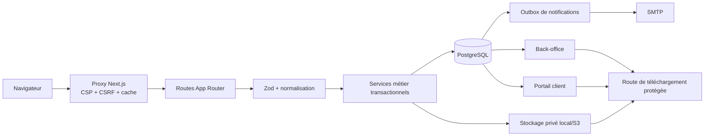

# Architecture des contacts et demandes de devis

## Vue d’ensemble

Le navigateur ne décide jamais de l’autorisation. `src/proxy.ts` traite les
protections transverses, tandis que les layouts et handlers vérifient
réellement la session, le rôle et la propriété de la ressource.

## Flux public

### Contact

1. `ContactForm` valide l’ergonomie et crée une clé UUID.
2. `POST /api/contact` exige JSON, l’en-tête `Idempotency-Key`, une origine
   valable, un corps borné, un honeypot vide et un éventuel jeton Turnstile.
3. Le service réserve une référence publique, écrit le contact, son premier
   statut et deux notifications dans une transaction PostgreSQL.
4. L’API retourne `201` et la référence. Une répétition retourne `409` avec la
   même référence ; elle ne crée aucune seconde ligne.

### Devis

1. Le wizard partage le même schéma métier que l’API.
2. Pour une session client, `GET/POST/DELETE /api/devis/draft` reprend,
   enregistre après chaque étape valide ou supprime le brouillon PostgreSQL.
3. `POST /api/devis` accepte uniquement `multipart/form-data`, cinq fichiers et
   30 Mo au total.
4. Les fichiers sont inspectés puis normalisés avant le stockage.
5. Les métadonnées, la demande, l’historique et l’outbox sont écrits ensemble.
   Un échec SQL entraîne la suppression compensatoire des objets déjà écrits.
6. Un brouillon soumis conserve sa référence et devient `submitted` dans la
   même transaction. Le succès redirige vers
   `/devis/merci?reference=DEV-…`.

Les soumissions anonymes sont pleinement persistées. Une soumission effectuée
avec une session est reliée au `user_id` et devient visible après reconnexion.

## États

Contacts :

`new → read/in_progress/spam → replied/closed → archived`

Demandes :

`draft → submitted → under_review → contacted/visit_scheduled → estimate_in_preparation
→ estimate_sent → accepted/rejected`, avec annulation et archivage selon les
transitions déclarées dans `src/domain/request-workflow.ts`.

Chaque changement compare le statut courant dans la clause `UPDATE`, ce qui
détecte les mises à jour concurrentes, puis ajoute une ligne d’historique dans
la même transaction.

## Notifications

La requête utilisateur ne dépend pas de SMTP. Elle ajoute deux événements
`pending` dans `notification_outbox` : notification interne et accusé client.
Le dispatcher revendique atomiquement chaque ligne, applique cinq tentatives
avec délai exponentiel et remet en file une tâche `processing` abandonnée
après quinze minutes.

## Interfaces

- `/admin/contacts` et `/admin/demandes` : données PostgreSQL, filtres,
  recherche, pagination, détail, historique et workflow.
- `/mon-compte/*` : requêtes filtrées par l’identifiant de session.
- `/api/files/quote-attachments/:id` : autorise un opérateur ou le propriétaire,
  puis lit l’objet privé sans exposer `storage_key`.
- `/api/client/privacy/export` : export du seul compte connecté, avec une liste
  explicite de colonnes non sensibles.

## Défaillances prévues

- Base indisponible : réponse générique `503`, jamais de faux succès.
- SMTP indisponible : la soumission reste réussie et l’outbox réessaie.
- Stockage indisponible : aucune demande de devis n’est confirmée.
- Transaction SQL refusée après upload : compensation immédiate ; le nettoyage
  quotidien récupère un éventuel orphelin résiduel.
- Instance Redis absente en local : limiteur mémoire acceptable en mono-instance.
  Redis partagé est requis en production distribuée.
