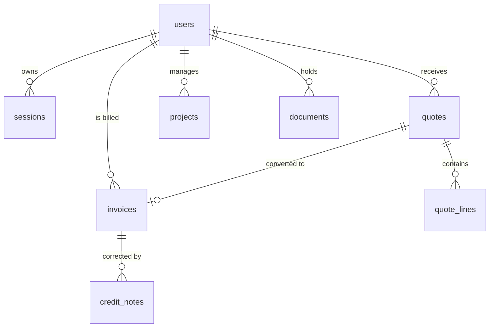

# Database Documentation (PostgreSQL + Drizzle ORM)



## 1. Modular Domain Tables (`src/db/schema/*`)
- **`users`**: UUID v4, normalized lowercase unique email, `password_hash` (bcrypt cost 12), role (`client` | `staff` | `admin`), soft delete (`deleted_at`), `locked_until`, `totp_secret`.
- **`sessions`**: Sessions with SHA-256 `token_hash`, `user_agent`, `ip_hash` and sliding expiration.
- **`tokens`**: Activation tokens (24h) and password reset tokens (15 min).
- **`quotes` & `quote_lines`**: Numbered quotes (`DEV-2026-XXXX`), HT amounts, VAT (6.00% / 21.00%), TTC, online signature timestamp and IP proof.
- **`invoices`**: **Immutable** invoices with continuous sequential numbering (`FACT-2026-XXXX`).
- **`credit_notes`**: Official credit notes for any accounting adjustment of an issued invoice.
- **`projects`**: Project milestone tracking (planned/actual dates, before/during/after photos, PV reception, decennial insurance).
- **`audit_log`**: **Append-only** audit log tracking all security events and modifications.

## 2. Database Commands
```bash
# Generate Drizzle Kit migrations
npm run db:generate

# Push schema to PostgreSQL
npm run db:push

# Run demo seed script
npm run db:seed
```
