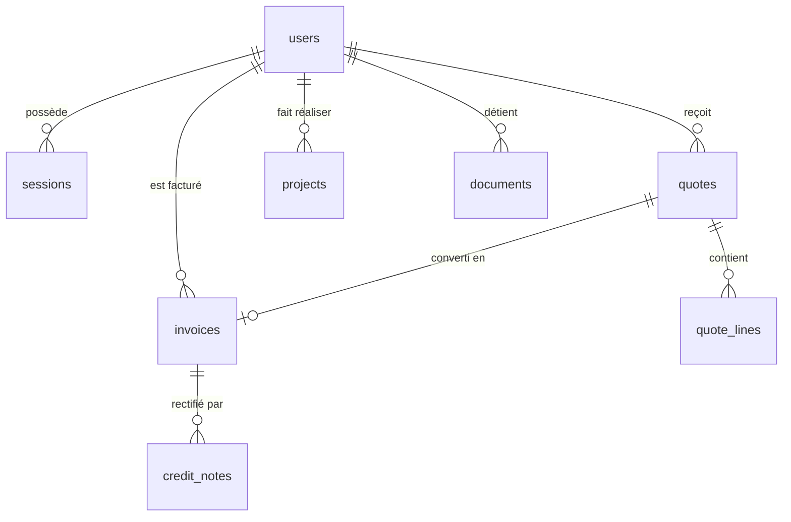

# Documentation de la Base de Données (PostgreSQL + Drizzle ORM)



## 1. Tables & Schémas Modulaires (`src/db/schema/*`)
- **`users`** : UUID v4, email unique normalisé, `password_hash` (bcrypt cost 12), rôle (`client` | `staff` | `admin`), suppression logique (`deleted_at`), `locked_until`, `totp_secret`.
- **`sessions`** : Sessions avec `token_hash` SHA-256, `user_agent`, `ip_hash` et expiration glissante.
- **`tokens`** : Jetons d'activation (24h) et de réinitialisation de mot de passe (15 min).
- **`quotes` & `quote_lines`** : Devis numérotés (`DEV-2026-XXXX`), montants HT, TVA (6.00% / 21.00%), TTC, horodatage et preuve d'IP de la signature.
- **`invoices`** : Factures **immuables** à numérotation séquentielle continue sans trou (`FACT-2026-XXXX`).
- **`credit_notes`** : Avoirs officiels pour toute rectification comptable d'une facture émise.
- **`projects`** : Suivi des chantiers (étapes, dates prévues/réelles, photos avant/pendant/après, PV de réception et décennale).
- **`audit_log`** : Registre d'audit **append-only** (inaltérable) retraçant toutes les actions de sécurité et modifications.

## 2. Commandes BDD
```bash
# Générer les migrations Drizzle Kit
npm run db:generate

# Pousser le schéma vers PostgreSQL
npm run db:push

# Exécuter le script de seed de démonstration
npm run db:seed
```
